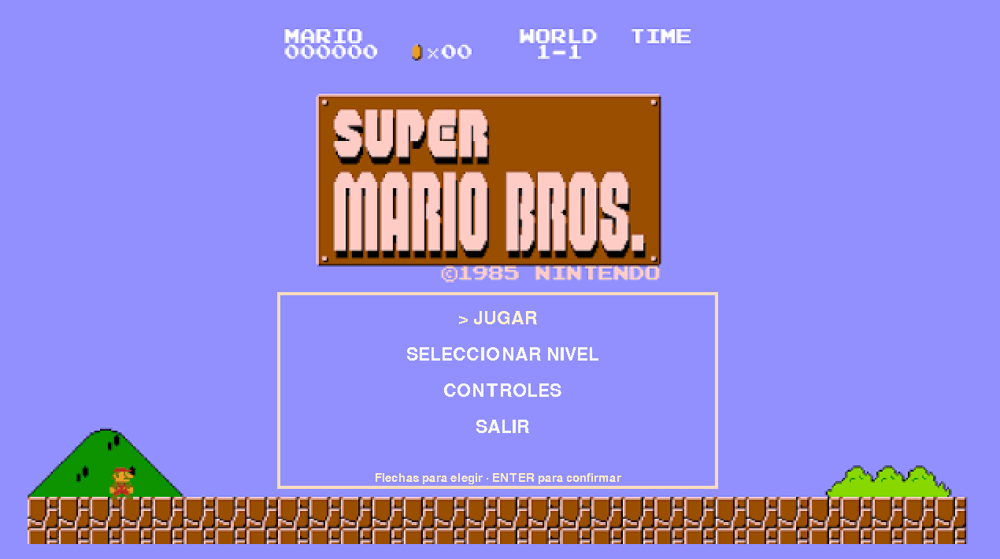
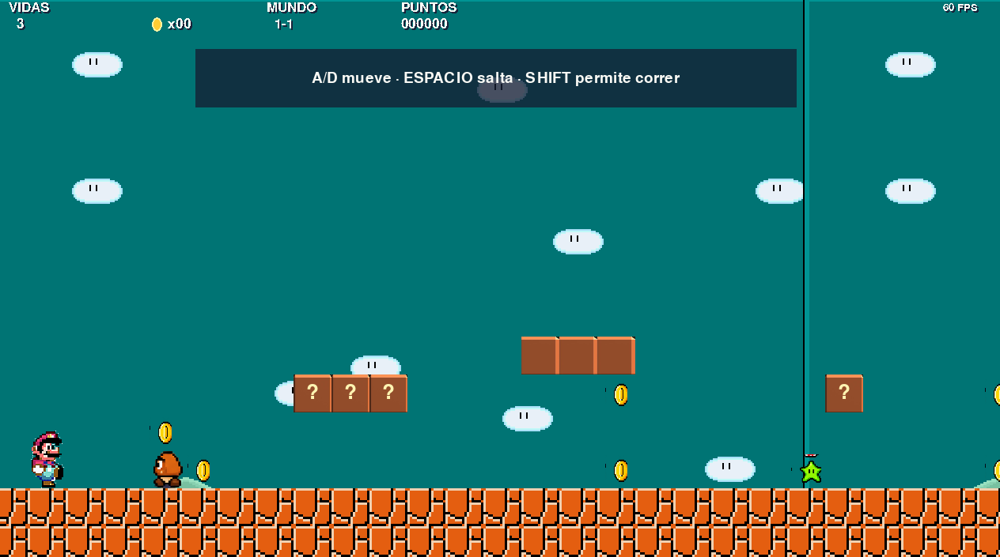

# Starbound Sprint

Videojuego de plataformas 2D desarrollado con Python y Pygame. Incluye cuatro niveles, físicas basadas en `delta time`, enemigos con comportamientos distintos, poderes temporales, efectos, cámara, HUD y un flujo completo de menús.





## Características

- Movimiento con aceleración, fricción, inercia, control aéreo y velocidad terminal.
- Salto variable, *coyote time*, buffer de salto y doble salto.
- Hitbox independiente del tamaño visual del sprite.
- Colisiones separadas por ejes y protección frente a atravesamientos a gran velocidad.
- Cuatro niveles JSON con dificultad y cantidad de enemigos progresivas.
- Enemigos Walker, Patrol, Jumper, Sheller y Planter.
- Monedas, bloques golpeables, checkpoints, peligros y meta con castillo.
- Poderes temporales de velocidad y gran salto.
- Animaciones y efectos actualizados mediante `delta time`.
- Menú principal, selector de nivel, controles, pausa, fin de nivel, victoria y game over.
- Fondos suministrados para el menú principal y los submenús.
- HUD de estilo pixel-art con vidas, monedas, mundo, puntos y poder activo.
- Progreso persistente y ventana redimensionable con lienzo lógico de 1280 × 720.
- Escalado por vecino más cercano, sin suavizar los sprites.

## Controles

| Acción | Teclas |
|---|---|
| Mover | A/D o flechas izquierda/derecha |
| Saltar | Espacio, W o flecha arriba |
| Doble salto | Volver a pulsar Espacio, W o flecha arriba en el aire |
| Correr | Shift |
| Pausa | Esc |
| Navegar por menús | Flechas o W/S |
| Confirmar | Enter o Espacio |

## Requisitos

- Python 3.12 o posterior
- Pygame Community Edition 2.5.3 o posterior

## Instalación

En PowerShell:

```powershell
python -m venv .venv
.venv\Scripts\Activate.ps1
python -m pip install -r requirements.txt
python main.py
```

## Pruebas

```powershell
python -m pytest
```

## Estructura

```text
main.py              Punto de entrada
game/                Bucle, estados, configuración, cámara, audio y progreso
entities/            Jugador, enemigos, monedas, poderes y efectos
physics/             Movimiento y resolución de colisiones
world/               Tiles, carga de mapas y nivel en ejecución
ui/                  HUD, menús y pantallas finales
levels/              Cuatro mapas JSON editables
assets/              Recursos externos y manifiesto de integración
tests/               Pruebas automatizadas
docs/                Material de documentación
```

## Formato de los niveles

Cada valor de `layout` representa un elemento:

| Valor | Elemento |
|---:|---|
| 0 | Vacío |
| 1 | Suelo |
| 2 | Bloque con moneda |
| 3 | Bloque o plataforma normal |
| 4 | Moneda |
| 5 | Enemigo |
| 6 | Poder |
| 7 | Checkpoint |
| 8 | Meta |
| 9 | Peligro |

`enemy_types` y `powerup_types` asignan las variantes en su orden de aparición.

## Integración de assets

El archivo `assets/manifest.json` permite configurar para cada recurso:

- archivo de origen;
- coordenadas de recorte;
- tamaño final;
- FPS de cada animación;
- orientación original;
- hitbox y desplazamiento visual;
- eliminación de color de fondo y umbral alfa.

Consulta [assets/README.md](assets/README.md) para conocer las convenciones de nombres y la integración de sprite sheets. Cuando falta un recurso, el juego lo informa y utiliza un placeholder temporal; nunca busca ni descarga assets automáticamente.

## Tecnología

Python, Pygame Community Edition, JSON, `pathlib` y pytest.
